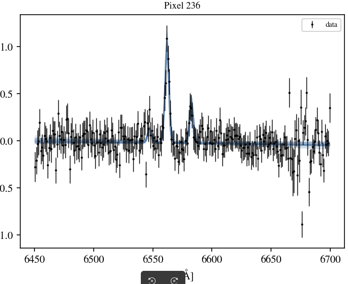

# emission_line_fit.py

Bayesian emission-line fitting pipeline for IFU spectral cubes, targeting the
Hα + NII doublet (λλ6549, 6583) complex. Designed for spatially-resolved
studies of galaxy disks and ram-pressure stripped tails, where robust
detection and uncertainty quantification are more important than speed.

---

## Overview

For each pre-selected spatial pixel, the pipeline fits a three-component
Gaussian emission-line model plus a linear continuum baseline using MCMC
(NUTS via NumPyro). Fits are run in parallel across all pixels using JAX
`vmap`, with optional GPU acceleration. Two independent detection criteria
are applied to the posterior samples to distinguish real line emission from
noise spikes.

**Spectral model** (6 free parameters per pixel):

```
F(λ) = c0 + c1·(λ − λ_mid)
     + A_Hα · G(λ; v_los, σ_v)
     + A_NII · G(λ; v_los, σ_v)          [NII 6583]
     + A_NII/3 · G(λ; v_los, σ_v)        [NII 6548, fixed ratio]
```

All three lines share a single `v_los` and `σ_v` (tied kinematics). The NII
doublet ratio is fixed at 1:3 (atomic physics constraint), leaving only one
free NII amplitude.

---

## Features

- **GPU-accelerated MCMC** via JAX + NumPyro: all pixels in a batch are
  vmapped into a single JIT-compiled computation graph
- **Data-driven NUTS initialisation**: per-pixel starting values estimated
  from peak-finding in the data before sampling begins, avoiding prior
  boundary attractors
- **Two-tier emission detection**:
  - *Tier 1*: 95% HDI on `A_Hα` excludes zero
  - *Tier 2*: WAIC model comparison between the line model and a
    continuum-only null model (ΔELPD > 6)
- **Convergence diagnostics**: per-pixel R-hat computed by splitting each
  chain into two pseudo-chains; pixels with R-hat > 1.05 are flagged
- **Single-pixel diagnostic mode**: run a high-warmup, non-vmapped chain on
  any individual pixel to investigate convergence issues or verify fits
- **Output maps**: 2-D FITS file with velocity, dispersion, amplitude,
  detection, and R-hat maps; ASCII per-pixel summary table; diagnostic
  figures

---

## Requirements

```bash
pip install "jax[cuda12]"   # or jax[cpu] if no GPU
pip install numpyro arviz astropy spectral-cube matplotlib
```

JAX must be installed with the appropriate CUDA build for your system.
See the [JAX installation guide](https://docs.google.com/document/d/1UJPTF-AQaZm6kR7LCK1dSoM8OijFSLVq0tHpD7kFBGI)
for details.

---

## Input data format

The pipeline expects spectra to be pre-extracted from a cube and
pre-selected on a signal-to-noise criterion before fitting. The
`format_spectra` function handles this from a standard IFU FITS cube:

| Array | Shape | Description |
|---|---|---|
| `spectra` | `(N, M)` | Flux per spectral channel |
| `ivar` | `(N, M)` | Inverse variance |
| `wavelength` | `(M,)` | Wavelength in Angstroms (rest-frame) |
| `xy_coords` | `(N, 2)` | Pixel (x, y) coordinates in the original cube |

where N is the number of selected pixels and M is the number of spectral
channels in the fitting window. Pixels are pre-selected by requiring S/N > 3
in a narrowband window bracketing the NII + Hα features.

---

## Usage

### Full pipeline

```bash
python emission_line_fit.py <cube.fits> <redshift>
```

Example:

```bash
python emission_line_fit.py galaxy_cube.fits 0.024
```

The script expects a FITS cube with:
- HDU 1: flux cube (spectral axis first: `[λ, y, x]`)
- HDU 2: inverse variance cube (same shape)

The wavelength axis is trimmed to a rest-frame window of 6450–6700 Å and
de-redshifted. Pixels with narrowband S/N < 3 are excluded.

### Single-pixel diagnostic

To investigate a specific pixel (e.g. one with suspicious posteriors in
the full run):

```bash
python emission_line_fit.py <cube.fits> <redshift> --pixel <N>
```

Example:

```bash
python emission_line_fit.py galaxy_cube.fits 0.024 --pixel 213
```

This runs a single non-vmapped chain with `num_warmup=2000` and produces
two diagnostic figures for that pixel:

- `posterior_pixel_0.png` — marginal posterior histograms for all 6 parameters
- `fit_pixel_0.png` — data with error bars, 50 posterior draw realisations, and median model

---

## Tuning parameters

All fitting parameters are defined in the `FIT_KWARGS` dict in `__main__`
and shared between full-pipeline and single-pixel modes. Edit these to
match your data:

| Parameter | Default | Description |
|---|---|---|
| `galaxy_v_kms` | `0.0` | Prior centre for `v_los` [km/s]. Set to 0 when fitting in the rest frame |
| `v_half_range` | `400.0` | Half-width of the uniform `v_los` prior [km/s] |
| `sigma_inst_kms` | `50.0` | Instrumental LSF width [km/s]; hard lower bound on `σ_v` |
| `a_ha_scale` | `100.0` | HalfNormal scale for `A_Hα` prior |
| `a_nii_scale` | `100.0` | HalfNormal scale for `A_NII` prior |
| `batch_size` | `400` | Pixels per vmap batch; reduce if GPU runs out of memory |
| `num_warmup` | `1000` | NUTS warmup steps per pixel |
| `num_samples` | `1000` | Posterior samples to draw per pixel |

### Priors

| Parameter | Prior | Notes |
|---|---|---|
| `v_los` | `Uniform(v_center ± v_half_range)` | Hard prior; set range to encompass expected rotation + tail velocities |
| `σ_v` | `Uniform(sigma_inst, 300)` km/s | Lower bound enforces minimum resolvable line width |
| `A_Hα` | `HalfNormal(a_ha_scale)` | Non-negative; scale to ~peak expected Hα flux |
| `A_NII` | `HalfNormal(a_nii_scale)` | Non-negative; scale to ~peak expected NII flux |
| `c0` | `Normal(0, cont_scale)` | Continuum intercept at window midpoint |
| `c1` | `Normal(0, cont_scale)` | Continuum slope |

### Choosing `batch_size`

`batch_size` controls how many pixels are vmapped simultaneously. It affects
only speed and memory, not results. A rough starting point:

| GPU VRAM | Suggested `batch_size` |
|---|---|
| 10–16 GB | 64–128 |
| 24 GB | 128–256 |
| 40 GB | 256–512 |

Start at a conservative value and double until you hit an out-of-memory
error, then back off by ~20%. Enabling `XLA_PYTHON_CLIENT_PREALLOCATE=false`
before running gives JAX more flexibility with memory:

```bash
XLA_PYTHON_CLIENT_PREALLOCATE=false python emission_line_fit.py ...
```

---

## Outputs

All outputs are written to the directory specified by `outdir` (default:
`results/`).

### Figures

| File | Description |
|---|---|
| `emission_line_maps.png` | 3×3 panel figure: detection map, velocity field, dispersion map, Hα amplitude map, and R-hat maps |
| `example_fits.png` | Posterior predictive check for the brightest, median, and faintest pixels |
| `posterior_pixel_N.png` | *(diagnostic mode)* Marginal posteriors for pixel N |
| `fit_pixel_N.png` | *(diagnostic mode)* Spectral fit for pixel N |

### Data files

| File | Description |
|---|---|
| `emission_maps.fits` | Multi-extension FITS file; one image extension per output map (see below) |
| `pixel_summary.txt` | ASCII table with one row per pixel |

### FITS extensions in `emission_maps.fits`

| Extension | Contents |
|---|---|
| `DETECTED_T1` | Tier-1 detection flag (HDI excludes zero) |
| `DETECTED_T2` | Tier-2 detection flag (WAIC model comparison) |
| `DETECTED_COMBINED` | T1 ∩ T2 — recommended detection map for science |
| `V_LOS_MED` | Median posterior `v_los` [km/s] |
| `V_LOS_STD` | Posterior std of `v_los` [km/s] |
| `SIGMA_V_MED` | Median posterior `σ_v` [km/s] |
| `SIGMA_V_STD` | Posterior std of `σ_v` [km/s] |
| `A_HA_MED` | Median posterior Hα amplitude |
| `A_HA_STD` | Posterior std of Hα amplitude |
| `A_NII_MED` | Median posterior NII 6583 amplitude |
| `A_NII_STD` | Posterior std of NII 6583 amplitude |
| `HDI_LO_HA` | Lower bound of 95% HDI on Hα amplitude |
| `HDI_HI_HA` | Upper bound of 95% HDI on Hα amplitude |
| `RHAT_V_LOS` | R-hat for `v_los` (< 1.05 indicates convergence) |
| `RHAT_SIGMA_V` | R-hat for `σ_v` |
| `RHAT_A_HA` | R-hat for `A_Hα` |

---

## Detection methodology

A pixel is classified as a detection only if it passes **both** criteria:

**Tier 1 — Amplitude HDI**
The 95% highest density interval of the `A_Hα` posterior must exclude zero.
This is fast and robust for high-S/N lines but can pass noise spikes that
happen to have a bright channel.

**Tier 2 — WAIC model comparison**
The full line model is compared against a continuum-only null model using the
Widely Applicable Information Criterion (WAIC, on the ELPD scale). The line
model must be preferred by ΔELPD > 6. This criterion naturally penalises
over-fitting of noise features because the predictive score is evaluated
out-of-sample. Noise spikes that passed Tier 1 typically fail here because
their posterior is broad and poorly predictive.

Pixels that fail either criterion appear as NaN in the velocity and
dispersion maps.

### Noise spike rejection

In addition to the two-tier detection, three automatic mechanisms flag
unreliable fits:

1. The `sigma_inst_kms` lower bound on the `σ_v` prior rejects lines
   narrower than the instrumental resolution
2. R-hat > 1.05 flags non-converged chains (chain split in half as two
   pseudo-chains)
3. The `WAIC` comparison penalises posteriors that are broad or
   multi-modal — the typical signature of a noise spike

---

## Interpreting the R-hat map

After the full run, check the `RHAT_A_HA` extension. Isolated pixels with
R-hat > 1.05 are normal and can be investigated with `--pixel`. A spatial
*cluster* of high-R-hat pixels coinciding with a region of interest (e.g.
the disk–tail interface) suggests that the vmap shared mass matrix is
struggling for those pixels; investigate a representative example with
`--pixel` and consider increasing `num_warmup`.

---

## Notes on float64

JAX defaults to float32. For this pipeline float32 is insufficient: at
typical recession velocities (hundreds of km/s), the HMC step sizes
required for NUTS fall below float32 machine epsilon relative to the
parameter values, causing the chain to freeze. The script therefore enables
float64 globally at startup:

```python
jax.config.update("jax_enable_x64", True)
```

This doubles GPU memory usage and reduces throughput somewhat compared to
float32, but is non-negotiable for correct sampling.


